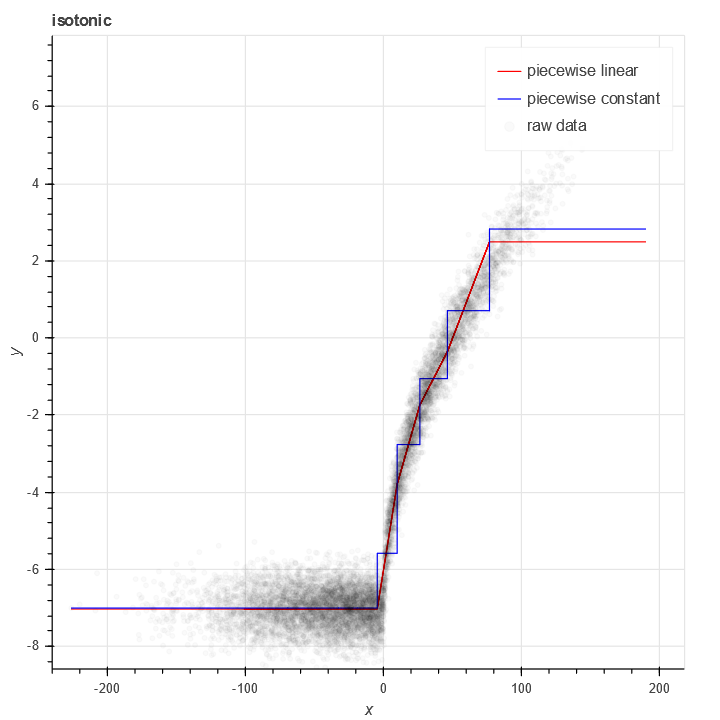
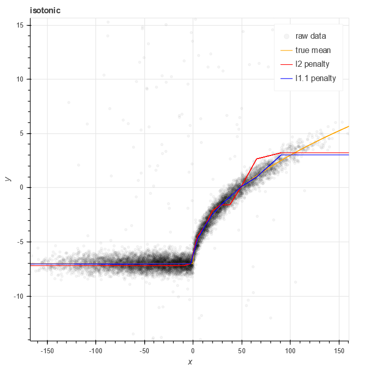
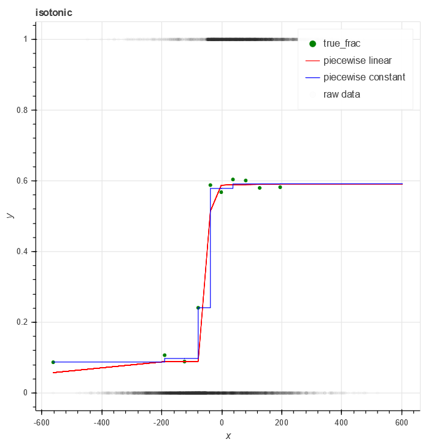

# Isotonic

Frequently in data science, we have a relationship between `X` and `y` where (probabilistically) `y` increases as `X` does.

There is a classical algorithm for solving this problem nonparametrically, specifically [Isotonic regression](https://en.wikipedia.org/wiki/Isotonic_regression). This simple algorithm is also implemented in [sklearn.isotonic](https://scikit-learn.org/stable/modules/generated/sklearn.isotonic.IsotonicRegression.html). The classic algorithm is based on a piecewise constant approximation - with nodes at every data point - as well as minimizing (possibly weighted) `l^2` error.

I'm a heavy user of isotonic regression, but unfortunately the version in sklearn does not meet my needs. Specific failings:

- My data is frequently binary. This means that each `y[i]` is either 0 or 1, but the probability that `y[i]==1` increasers as `x[i]` increases.
- My data is often noisy with fatter than normal tails, which means that minimizing `l^2` error overweights outliers.
- The size of the isotonic model is large - `O(N)`, in fact (with `N` the size of the training data).
- The curves output by sklearn's isotonic model are piecewise constant with a large number of discontinuities (`O(N)` of them).

This library is an attempt to solve these problems once and for all.

More info on details and motivation is described in a [companion blog post](https://www.chrisstucchio.com/blog/2020/isotonic_python_package.html).

# Usage

## Real valued curves

To fit a curve to real valued data using mean squared error, it's it's pretty straightforward:

    from scipy.stats import norm, bernoulli
    import numpy as np

    N = 10000
    x = norm(0,50).rvs(N) - bernoulli(0.25).rvs(N)*50
    y = -7+np.sqrt(np.maximum(x, 0)) + norm(0,0.5).rvs(N)

    from isotonic import LpIsotonicRegression
    from isotonic.curves import PiecewiseLinearIsotonicCurve, PiecewiseConstantIsotonicCurve

    import pandas as pd
    from bokeh.plotting import figure, output_notebook, show
    from bokeh.models import Span, LinearAxis, Range1d, ColumnDataSource
    output_notebook()

    plot = figure(
        tools="pan,box_zoom,reset,save,",
        y_axis_label="y", title="isotonic",
        x_axis_label='x'
    )

    curve = LpIsotonicRegression(10, increasing=True, curve_algo=PiecewiseLinearIsotonicCurve).fit(x, y)
    curve2 = LpIsotonicRegression(10, increasing=True, curve_algo=PiecewiseConstantIsotonicCurve).fit(x, y)
    #curve = PiecewiseIsotonicCurve(x_cuts, gamma_of_alpha(result.x))
    xx = np.arange(x.min(), x.max(), 0.01)
    plot.line(xx, curve.predict_proba(xx), color='red', legend_label='piecewise linear')
    plot.line(xx, curve2.predict_proba(xx), color='blue', legend_label='piecewise constant')

    plot.circle(x, y, color='black', alpha=0.02, legend_label='raw data')

    show(plot)

Like most regression methods based on `l^2` loss, isotonic regression is sensitive to noise. As the name `LpIsotonicRegression` suggests, one can use alternate powers to accomodate greater degrees of noise. Consider the same example as above, but 5% of the samples are corrupted by high intensity Laplacian noise:

    y = -7+np.sqrt(np.maximum(x, 0)) + norm(0,0.5).rvs(N) + bernoulli(0.05).rvs(N) * laplace(scale=50).rvs(N)

We can compare the result of `LpIsotonicRegression` with different powers. Choosing an norm `l^p` for `p` nearly 1 yields a fit significantly less sensitive:

    curve = LpIsotonicRegression(20, power=2, increasing=True, curve_algo=PiecewiseLinearIsotonicCurve).fit(x, y)
    curve2 = LpIsotonicRegression(20, power=1.1, increasing=True, curve_algo=PiecewiseLinearIsotonicCurve).fit(x, y)

## Isotonic probability estimation

In many cases the data I wish to handle is binary, not real valued. That is, every `y[i]` is either `0` or `1`. The value I wish to estimate is the probability that `y == 1`, given a value of `x`.

In `isotonic`, this is handled with the `BinomialIsotonicRegression` class. This fits a curve to binary data based on a binomial loss function.

    from isotonic import BinomialIsotonicRegression
    from isotonic.curves import PiecewiseLinearIsotonicCurve, PiecewiseConstantIsotonicCurve

    import pandas as pd
    from bokeh.plotting import figure, output_notebook, show
    from bokeh.models import Span, LinearAxis, Range1d, ColumnDataSource
    output_notebook()

    plot = figure(
        tools="pan,box_zoom,reset,save,",
        y_axis_label="y", title="isotonic",
        x_axis_label='x'
    )

    M = 10
    x_cuts = np.quantile(x, np.arange(0,1,1/M))
    df = pd.DataFrame({'x': x, 'y': y, 'x_c': x_cuts[np.digitize(x, x_cuts)-1]})
    grouped = df.groupby('x_c')['y'].mean().reset_index()

    plot.circle(grouped['x_c'], grouped['y'], color='green', legend_label='true_frac')

    curve = BinomialIsotonicRegression(10, increasing=True, curve_algo=PiecewiseLinearIsotonicCurve).fit(x, y)
    curve2 = BinomialIsotonicRegression(10, increasing=True, curve_algo=PiecewiseConstantIsotonicCurve).fit(x, y)

    xx = np.arange(x.min(), x.max(), 0.01)
    plot.line(xx, curve.predict_proba(xx), color='red', legend_label='piecewise linear')
    plot.line(xx, curve2.predict_proba(xx), color='blue', legend_label='piecewise constant')

    plot.circle(x, y, color='black', alpha=0.01, legend_label='raw data')
    show(plot)

